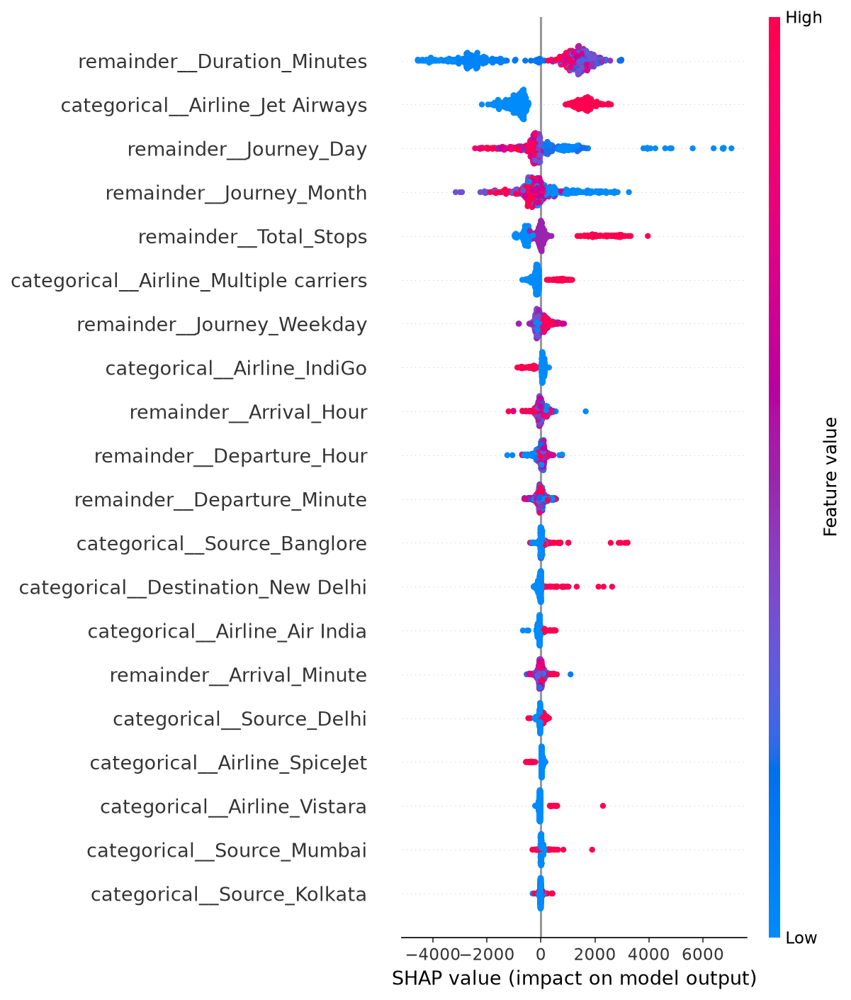

# Flight Price Prediction

Predicting airline ticket prices using machine learning regression modeling, hyperparameter tuning, and SHAP-based AI explainability, served through an interactive Streamlit application.


---

## Table of Contents

- [Project Overview](#project-overview)
- [Features](#features)
- [Dataset](#dataset)
- [Tech Stack](#tech-stack)
- [Project Architecture / Workflow](#project-architecture--workflow)
- [Repository Structure](#repository-structure)
- [Installation](#installation)
- [Usage](#usage)
- [Models Used](#models-used)
- [Model Evaluation](#model-evaluation)
- [Results](#results)
- [Future Improvements](#future-improvements)
- [Screenshots](#screenshots)
- [Contributing](#contributing)
- [License](#license)
- [Author](#author)

---

## Project Overview

Airline ticket prices fluctuate based on a combination of factors — airline, route, number of stops, journey timing, and duration — that are not transparent to the end buyer and are non-trivial to model directly.

This project builds a complete regression pipeline that predicts flight ticket prices from these underlying factors, benchmarks multiple algorithms against each other, tunes the strongest candidates under strict data-leakage-free conditions, and explains individual predictions using SHAP rather than treating the model as a black box.

**Why it matters:**
- Buyers get a data-driven price estimate before booking, rather than relying on guesswork or manual comparison across listings.
- Travel platforms can use similar pipelines to power price-alert features, fare-trend analysis, or anomaly detection on mispriced listings.
- The explainability layer means predictions are auditable — stakeholders can see *why* a given price was predicted, not just the number itself.

**Target users:** Travel-tech platforms, fare comparison tools, and data science teams evaluating fare prediction as a feature; also serves as a reference implementation of a leakage-safe, explainable ML regression pipeline.

---

## Features

- **End-to-End Pipeline**: From raw data cleaning to feature engineering, baseline selection, hyperparameter tuning, and a live Streamlit app.
- **Leakage-Safe Architecture**: Partitioned explicit `train.csv` (70%), `val.csv` (15%), and `test.csv` (15%) dataset splits to prevent data leakage during preprocessing and tuning.
- **Model-Specific Preprocessing**: Model-aware preprocessing pipeline that applies `StandardScaler` for Linear Regression while leaving numeric features unscaled for tree ensembles.
- **Benchmarking**: Evaluation across 8 regression algorithms under identical validation conditions.
- **Automated Hyperparameter Tuning**: `RandomizedSearchCV` cross-validation on top-performing candidates.
- **Model Explainability**: SHAP (SHapley Additive exPlanations) for global feature importance and per-prediction waterfall breakdowns.
- **Interactive Streamlit App**: Instant price estimates and feature breakdown visualizations.

---

## Dataset

| Attribute | Details |
|---|---|
| **Source** | Kaggle — Flight Price Prediction dataset |
| **Size** | ~10,680+ flight records |
| **Target Variable** | `Price` (ticket price in ₹) |
| **Key Features** | Airline, Source, Destination, Route, Date of Journey, Departure Time, Arrival Time, Duration, Total Stops |

**Preprocessing performed:**
- Extracted `Journey_Day`, `Journey_Month`, and `Journey_Weekday` from `Date_of_Journey`.
- Converted departure and arrival timestamps into separate hour and minute features.
- Standardized flight duration strings (e.g., `2h 50m`) into total minutes (`Duration_Minutes`).
- Mapped `Total_Stops` text categories (e.g., `non-stop`, `1 stop`) into ordinal integers.
- Removed missing values and duplicate records.
- Encoded categorical variables (`Airline`, `Source`, `Destination`) using `OneHotEncoder` inside a scikit-learn `Pipeline`.

---

## Tech Stack

| Category | Tools |
|---|---|
| **Programming Language** | Python 3.11 |
| **Libraries** | Pandas, NumPy, Scikit-learn, Joblib |
| **Machine Learning Models** | Linear Regression, Decision Tree, Random Forest, Gradient Boosting, Extra Trees, XGBoost, LightGBM, CatBoost |
| **Explainability** | SHAP |
| **Visualization** | Matplotlib, Seaborn |
| **Deployment** | Streamlit, Streamlit Community Cloud |
| **Version Control** | Git, GitHub |

---

## Project Architecture / Workflow

<details>
<summary><strong>Click to expand full pipeline description</strong></summary>

1. **Data Collection** — Raw flight data stored under `data/raw/`.
2. **Data Cleaning & Feature Engineering** — Text fields decomposed into numeric date/time features; duration converted to total minutes (`data/processed/featured_train.csv`).
3. **Data Splitting (`src/data_split.py`)** — Explicit 70% Train, 15% Validation, and 15% Test partitioning (`data/processed/split/`) to guarantee zero test-set data leakage.
4. **Model-Specific Preprocessing (`src/preprocessing.py`)** — Categorical features one-hot encoded inside a `ColumnTransformer`; `StandardScaler` applied only for Linear Regression.
5. **Baseline Benchmarking (`05_Preprocessing_and_Baseline_Modeling.ipynb`)** — Eight regression algorithms trained on `train.csv` and evaluated against `val.csv`.
6. **Hyperparameter Tuning (`06_Hyperparameter_Tuning.ipynb`)** — Top baseline performers tuned via `RandomizedSearchCV` with 3-fold cross-validation on `train.csv` and scored on `val.csv`.
7. **Final Unbiased Test Evaluation (`07_SHAP_Explainability.ipynb`)** — One-time evaluation of the serialized tuned model on the held-out `test.csv`.
8. **Explainability & App Serving (`app/app.py`)** — Serialized pipeline served via interactive Streamlit app with live SHAP waterfall plots.

</details>

---

## Repository Structure

```
flight-price-prediction/
│
├── app/
│   └── app.py                     # Streamlit web application
│
├── data/
│   ├── raw/                       # Original raw dataset
│   └── processed/                 # Feature-engineered dataset & split subsets
│       └── split/                 # Fixed train.csv (70%), val.csv (15%), test.csv (15%)
│
├── notebooks/
│   ├── 01_Data_Understanding.ipynb
│   ├── 02_EDA.ipynb
│   ├── 03_Data_Cleaning.ipynb
│   ├── 04_Feature_Engineering.ipynb
│   ├── 05_Preprocessing_and_Baseline_Modeling.ipynb
│   ├── 06_Hyperparameter_Tuning.ipynb
│   └── 07_SHAP_Explainability.ipynb
│
├── src/
│   ├── __init__.py                # Package initializer
│   ├── data_split.py               # Train/val/test data partitioner
│   ├── preprocessing.py            # Model-aware ColumnTransformer pipeline
│   ├── model_factory.py            # Candidate regression model definitions
│   ├── evaluation.py               # MAE, RMSE, R² metrics
│   ├── tuning.py                   # Hyperparameter search grids
│   └── utils.py                    # Pipeline IO and formatting helpers
│
├── models/
│   ├── best_baseline_model.pkl    # Serialized best baseline model
│   └── final_tuned_model.pkl      # Serialized final production model
│
├── results/
│   ├── baseline_results.csv       # Validation baseline rankings
│   └── tuned_results.csv          # Hyperparameter tuning results
│
├── screenshots/
│   └── shap_summary_plot.png      # Global SHAP feature importances
│
├── requirements.txt
├── .gitignore
└── README.md
```

---

## Installation

```bash
# Clone the repository
git clone https://github.com/Arushikhare6/flight-price-prediction.git
cd flight-price-prediction

# Create and activate a virtual environment
python -m venv venv
venv\Scripts\activate        # Windows
source venv/bin/activate     # macOS / Linux

# Install dependencies
pip install -r requirements.txt
```

---

## Usage

**Run the web prediction app:**

```bash
streamlit run app/app.py
```

**Reproduce the machine learning pipeline from scratch (optional):**

1. Generate data splits:
   ```bash
   python src/data_split.py
   ```
2. Run notebooks `01` through `07` sequentially in Jupyter Notebook / JupyterLab:
   ```bash
   jupyter notebook notebooks/
   ```

---

## Models Used

| Model | Category | Characteristics |
|---|---|---|
| **Linear Regression** | Parametric Baseline | Simple, fast, linear baseline (uses `StandardScaler`) |
| **Decision Tree** | Tree Baseline | Non-linear relationships, intuitive decision logic |
| **Random Forest** | Bagging Ensemble | Reduces variance via bootstrap aggregation |
| **Gradient Boosting** | Boosting Ensemble | Sequential error correction via gradient boosting |
| **Extra Trees** | Extremely Randomized Trees | Random split points for variance reduction |
| **XGBoost** | Optimized Boosting | High performance, regularized gradient boosting |
| **LightGBM** | Leaf-Wise Boosting | Fast, memory-efficient histogram-based boosting |
| **CatBoost** | Categorical Boosting | Native symmetric tree boosting |

---

## Model Evaluation

### Baseline Validation Performance (`results/baseline_results.csv`)

Evaluated strictly on the validation set (`val.csv`):

| Model | MAE (₹) | RMSE (₹) | Validation R² Score |
|---|---|---|---|
| **XGBoost** | 1,270.78 | 2,232.74 | **0.7656** |
| **LightGBM** | 1,284.07 | 2,271.65 | **0.7574** |
| **Random Forest** | 1,275.72 | 2,292.52 | **0.7529** |
| **CatBoost** | 1,412.69 | 2,358.70 | 0.7384 |
| **Extra Trees** | 1,331.30 | 2,573.82 | 0.6885 |
| **Gradient Boosting** | 1,564.82 | 2,575.05 | 0.6882 |
| **Decision Tree** | 1,485.80 | 2,748.60 | 0.6448 |
| **Linear Regression (Scaled)** | 1,994.11 | 3,088.01 | 0.5516 |

---

## Results

### Final Production Model Evaluation (Unbiased Test Set `test.csv`)

The final tuned **Random Forest Regressor** model was selected for production deployment after hyperparameter optimization on `R2 Score`. Evaluated once against the held-out test set (`test.csv`):

- **Final Test R² Score**: **`0.8151`** (explains ~81.5% of ticket price variance)
- **Mean Absolute Error (MAE)**: **`₹1,169.24`**
- **Root Mean Squared Error (RMSE)**: **`₹2,015.51`**

SHAP TreeExplainer analysis confirmed that **Duration**, **Total Layover Stops**, **Airline Carrier**, and **Departure Month** are the strongest drivers of ticket pricing.

---

## Future Improvements

- **GPS Distance Features**: Calculate flight distance in kilometers from airport coordinates to enable predictions on new routes.
- **Dynamic Demand Features**: Incorporate holiday and seasonal travel indicators.
- **Unseen Category Handling**: Target encoding or frequency encoding for expansion to smaller regional airports.
- **CI/CD Integration**: Automated pipeline testing and Streamlit deployment workflows.

---

## Screenshots

**SHAP Global Feature Importance**



---

## License

This project is licensed under the MIT License. See the [LICENSE](LICENSE) file for details.

---

## Author

**Name:** Arushi Khare  
**GitHub:** [@Arushikhare6](https://github.com/Arushikhare6)  
